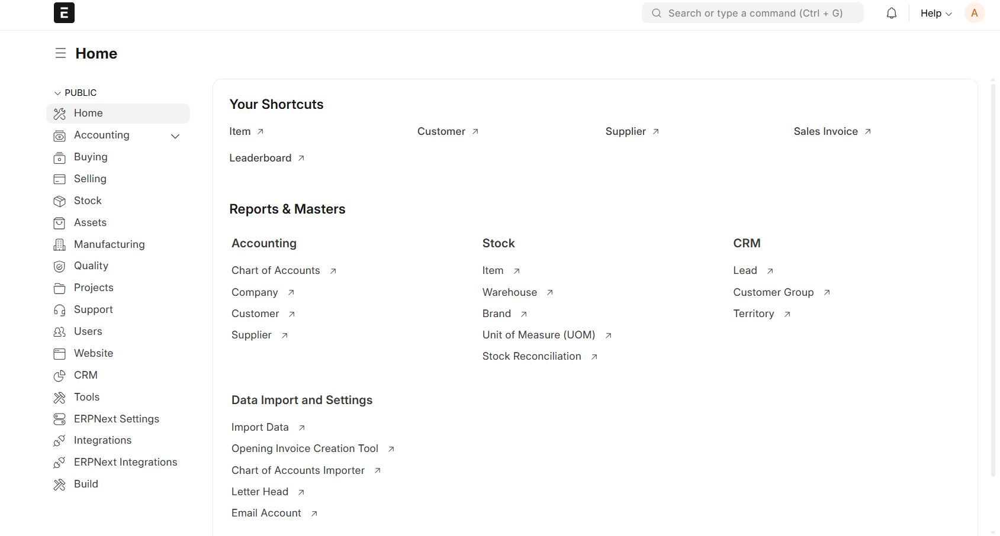

# HRMS Freelancer Extension

[](https://github.com/hamedrhni/hrms_freelancer/actions)
[](https://opensource.org/licenses/MIT)
[](https://www.python.org/downloads/)
[](https://frappeframework.com/)

A comprehensive Frappe Framework extension for managing freelancers, independent contractors, and self-employed workers alongside traditional employees.



## 🌟 Features

### Core Functionality
- **Freelancer/Contractor Mode**: Toggle between employee and contractor management
- **Contract Management**: Handle contract terms, milestones, rates, and renewals
- **Invoice Generation**: Generate invoices instead of payroll slips for contractors
- **Performance Tracking**: Track deliverables and milestones
- **Expense Management**: Process reimbursements without benefits overhead

### International Compliance

#### EU Freelancers
- EU residency handling with tax treaty support
- VAT reverse charge mechanism for cross-border services
- GDPR-compliant data handling with consent management
- Posted Workers Directive (96/71/EC) compliance tracking
- Social security coordination under Regulation (EC) No 883/2004

#### Non-EU Freelancers
- Withholding tax calculations based on bilateral treaties
- Support for US 1099-style reporting
- Multi-currency payments with exchange rate integration
- Common treaty support (US, UK, India, etc.)

### 2026 Standards
- Updated tax slabs and rates
- EU minimum wage compliance checks
- Current regulatory requirements

## 📦 Installation

### Prerequisites
- Python 3.10+
- Frappe Framework v15+
- ERPNext v15+
- Frappe HRMS v15+
- Bench CLI

### Via Bench

```bash
# Navigate to your bench directory
cd frappe-bench

# Get the app
bench get-app https://github.com/hamedrhni/hrms_freelancer

# Install on your site
bench --site your-site.local install-app hrms_freelancer

# Run migrations
bench --site your-site.local migrate
```

### Via Docker

```bash
# Clone the repository
git clone https://github.com/hamedrhni/hrms_freelancer.git
cd hrms_freelancer

# Copy environment template
cp .env.example .env

# Edit .env and set secure passwords
# nano .env

# Start containers
docker-compose up -d
```

See [RUNNING_LOCALLY.md](RUNNING_LOCALLY.md) for detailed instructions.

## 🚀 Quick Start

### 1. Configure Worker Types
Navigate to **HR Settings > Worker Types** and configure your organization's worker categories.

### 2. Create a Freelancer Profile
1. Go to **HR > Freelancer > New Freelancer**
2. Fill in personal and professional details
3. Select residency country and tax status
4. Upload required documents

### 3. Set Up Contracts
1. Create a new contract from **HR > Contracts > New Contract**
2. Define terms, rates, and milestones
3. Configure payment schedules
4. Set up compliance requirements

### 4. Process Payments
1. Navigate to **HR > Freelancer Payments**
2. Create invoice from deliverables/hours
3. System calculates taxes, VAT, and withholdings
4. Approve and route to ERPNext Accounts Payable

## 📊 Doctypes

### Core Doctypes
| Doctype | Description |
|---------|-------------|
| `Freelancer` | Extended employee profile for contractors |
| `Freelancer Contract` | Contract terms and conditions |
| `Freelancer Payment` | Invoice-based payment processing |
| `Freelancer Expense` | Expense claims for contractors |
| `Freelancer Milestone` | Project milestone tracking |

### Compliance Doctypes
| Doctype | Description |
|---------|-------------|
| `Tax Treaty` | International tax treaty configurations |
| `VAT Configuration` | EU VAT rates and rules |
| `Compliance Checklist` | Regulatory compliance tracking |
| `GDPR Consent Log` | Data consent management |

## 💱 Multi-Currency Support

The extension supports multiple currencies with:
- Automatic exchange rate fetching via Open Exchange Rates API
- Manual rate override capability
- Historical rate tracking
- Integration with ERPNext Currency Exchange

```python
# Example: Convert payment to EUR
from hrms_freelancer.utils.currency import convert_currency

amount_eur = convert_currency(
    amount=5000,
    from_currency="USD",
    to_currency="EUR",
    date="2026-01-31"
)
```

## 🔒 Security & Privacy

### GDPR Compliance
- Explicit consent tracking
- Data portability exports (JSON, CSV)
- Right to erasure implementation
- Processing activity logs
- Third-party sharing controls

### Access Control
- Role-based permissions
- Contractor self-service portal
- Audit trail for all actions
- Encrypted sensitive data storage

## 📈 Reports

### Built-in Reports
- Freelancer Payment Summary
- Contract Status Overview
- Tax Withholding Report
- VAT Summary (EU)
- Compliance Status Dashboard
- Multi-Currency Reconciliation

### Custom Reports
Use Frappe's Report Builder or Query Reports for custom analytics.

## 🌐 Localization

Supported languages:
- 🇬🇧 English (default)
- 🇳🇱 Dutch
- 🇩🇪 German
- 🇫🇷 French
- 🇪🇸 Spanish

## ⚠️ Disclaimer

**This software is for estimation and management purposes only.**

- Always consult qualified legal, tax, and HR professionals for compliance matters
- Tax calculations are estimates and may not reflect your specific situation
- Regulations vary by jurisdiction and change frequently
- The developers are not liable for any decisions made based on this software

### Useful Resources
- [EU Labour Mobility](https://ec.europa.eu/social/main.jsp?catId=471)
- [EU Freelancers' Guide](https://ec.europa.eu/growth/smes/supporting-entrepreneurship/freelancers_en)
- [International Labour Organization](https://www.ilo.org/)

## 🤝 Contributing

We welcome contributions! Please see our [Contributing Guide](CONTRIBUTING.md) for details.

### Quick Start for Contributors

```bash
# Fork and clone the repository
git clone https://github.com/hamedrhni/hrms_freelancer.git
cd hrms_freelancer

# Set up development environment with Docker
cp .env.example .env
docker-compose up -d

# Or with Bench
bench get-app https://github.com/hamedrhni/hrms_freelancer
bench --site test_site install-app hrms_freelancer

# Run tests
python test_standalone_v2.py
pytest hrms_freelancer/tests/
```

## 📄 License

This project is licensed under the MIT License - see the [LICENSE](LICENSE) file for details.

## 🔒 Security

Please review our [Security Policy](SECURITY.md) before deploying to production.

For security vulnerabilities, please email security@example.com instead of using the issue tracker.

## 📚 Documentation

- [Installation Guide](RUNNING_LOCALLY.md)
- [Contributing Guidelines](CONTRIBUTING.md)
- [Code of Conduct](CODE_OF_CONDUCT.md)
- [Security Policy](SECURITY.md)

## 📞 Support & Community

- **Issues**: [GitHub Issues](https://github.com/hamedrhni/hrms_freelancer/issues)
- **Discussions**: [GitHub Discussions](https://github.com/hamedrhni/hrms_freelancer/discussions)
- **Documentation**: [Installation Guide](RUNNING_LOCALLY.md)

## 🌟 Acknowledgments

- Built on [Frappe Framework](https://frappeframework.com/)
- Extends [ERPNext](https://erpnext.com/)
- Complements [Frappe HRMS](https://github.com/frappe/hrms)

## 📈 Project Status

This project is actively maintained. See the [CHANGELOG](CHANGELOG.md) for version history.

